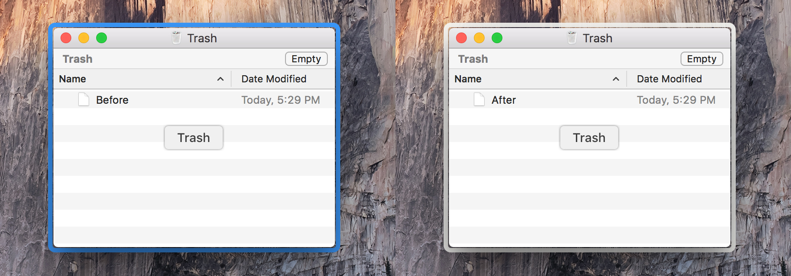

This is a [Parasite](https://github.com/ParasiteTeam) Extension that changes the color of selected window border in Exposé.



##Install

1. [Disable SIP](http://osxdaily.com/2015/10/05/disable-rootless-system-integrity-protection-mac-os-x/) and [Install Parasite](https://github.com/ParasiteTeam/installer).

2. Get the code and compile:

```
git clone https://github.com/husile/DockExposeHighlight
cd DockExposeHighlight && xcodebuild
```

3. Copy the compiled bundle into `/Library/Parasite/Extensions` and restart Dock:

```
sudo cp -rfv build/Release/DockExposeHighlight.bundle /Library/Parasite/Extensions
killall Dock
```

##Uninstall

```
sudo rm -rfv /Library/Parasite/Extensions/DockExposeHighlight.bundle && killall Dock
```

Run Parasite installer again if you need to further uninstall Parasite.

##License
Do whatever you want. Please use it at your own risk.

##Note
El Capitan only. For older versions of OS X, please read [here](http://osxdaily.com/2010/08/30/change-the-expose-highlight-glow-color/).
